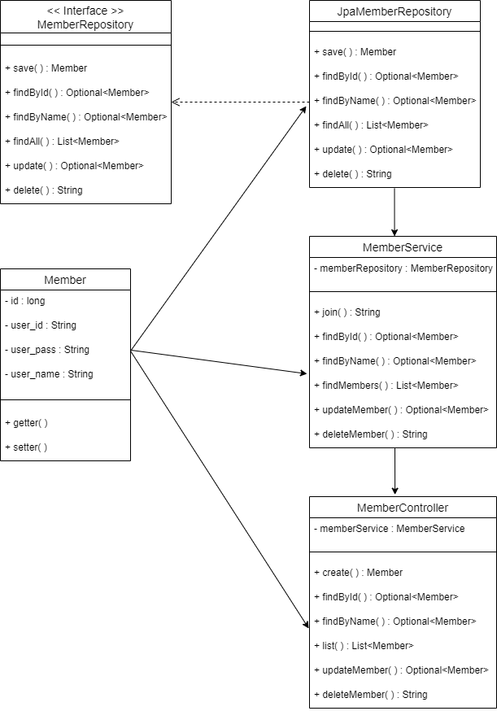
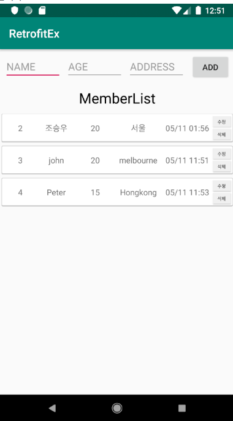
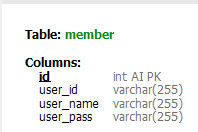

# SPRING_AWS-EC2_ANDROID_CRUD_API
make a CRUD program - API Server with JAVA SPRING and ANDROID Client
2021.07

___
- ### 목차
  - [**프로젝트 개요**](#outline)
  - [**요구사항**](#requirements)
  - [**프로젝트 구조**](#structure)
  - [**화면**](#screen) 

___
- ### 프로젝트 개요 
  - Java Spring FrameWork 와 Android Java 를 활용한 CRUD 프로그램 제작
  - Spring으로 API 형식 서버 구현하여 JSON 형식 데이터를 HTTP 본문에 넣어 반환하도록 함.
  - AWS RDS 의 MySQL 을 활용하여 DataBase로 사용. 
  - Android에서 retrofit2 를 활용하여 Spring 서버와 HTTP 통신을 하도록 함.
  - Spring 프로그램을 AWS EC2 서버에 올려 빌드 시킴. 
___
- ### 요구사항
  - CRUD
    - 사용자 정보 등록 / 조회 / 수정 / 삭제 기능 구현
___
- ### 프로젝트 구조  
  - 
  - HTTP 통신
    - CREATE
      - |항목|Key|Value|
        |------|---|---|
        |url||/members/new|
        |method||POST|
        |Body|||
        ||user_id|(String)user_id|
        ||user_name|(String)user_name|
        ||user_pass|(String)user_pass|
        |Result(JSON)|||
        |array of|||
        ||user_id|(String)user_id|
        ||user_name|(String)user_name|
        ||user_pass|(String)user_pass|
    - READ
      - |항목|Key|Value|
        |------|---|---|
        |url||/members|
        |method||GET|
        |Result(JSON)|||
        |array of|||
        ||user_id|(String)user_id|
        ||user_name|(String)user_name|
        ||user_pass|(String)user_pass|
      - |항목|Key|Value|
        |------|---|---|
        |url||/members/findById|
        |method||GET|
        |parameter|||
        ||user_id|(String)user_id|
        |Result(JSON)|||
        |array of|||
        ||user_id|(String)user_id|
        ||user_name|(String)user_name|
        ||user_pass|(String)user_pass|
      - |항목|Key|Value|
        |------|---|---|
        |url||/members/findByName|
        |method||GET|
        |parameter|||
        ||user_name|(String)user_name|
        |Result(JSON)|||
        |array of|||
        ||user_id|(String)user_id|
        ||user_name|(String)user_name|
        ||user_pass|(String)user_pass|
    - UPDATE
      - |항목|Key|Value|
        |------|---|---|
        |url||/members/update|
        |method||POST|
        |parameter|||
        ||user_name|(String)user_name|
        |Body|||
        ||user_id|(String)user_id|
        ||user_name|(String)user_name|
        ||user_pass|(String)user_pass|
        |Result(JSON)|||
        |array of|||
        ||user_id|(String)user_id|
        ||user_name|(String)user_name|
        ||user_pass|(String)user_pass|
    - DELETE
      - |항목|Key|Value|
        |------|---|---|
        |url||/members/delete|
        |method||POST|
        |parameter|||
        ||user_id|(String)user_id|
___
- ### 화면 
  - Client
    - 
  - MySQL DDL
    - 
